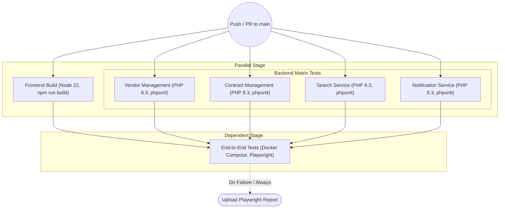

# Continuous Integration (CI) Pipeline

This document illustrates the flow of our GitHub Actions CI pipeline, which ensures code quality and stability for the CRMS Capstone monorepo.

## Pipeline Architecture

GitHub natively supports Mermaid diagrams. The flowchart below visualizes the execution order of our CI pipeline.

## Stage Descriptions

1. **Trigger**: The pipeline is automatically triggered when a commit is pushed to the `main` branch or when a Pull Request is opened against `main`.
2. **Parallel Stage**:
   - **Frontend Build**: Installs Node dependencies and compiles the Vue application, ensuring there are no TypeScript or build errors.
   - **Backend Matrix Tests**: Spawns four separate, parallel jobs for each Laravel service. It installs Composer dependencies and runs the PHPUnit tests for each respective service.
3. **Dependent Stage (End-to-End Tests)**: This job will **only** start if the Frontend Build and *all four* Backend Test jobs complete successfully. It brings up the entire Docker Compose stack, waits for all services to be responsive, and executes the Playwright test suite against the live application.
4. **Artifacts**: If the Playwright tests fail (or run), the test report is uploaded as a GitHub Artifact, allowing developers to download the report and see exactly where the browser tests failed.
