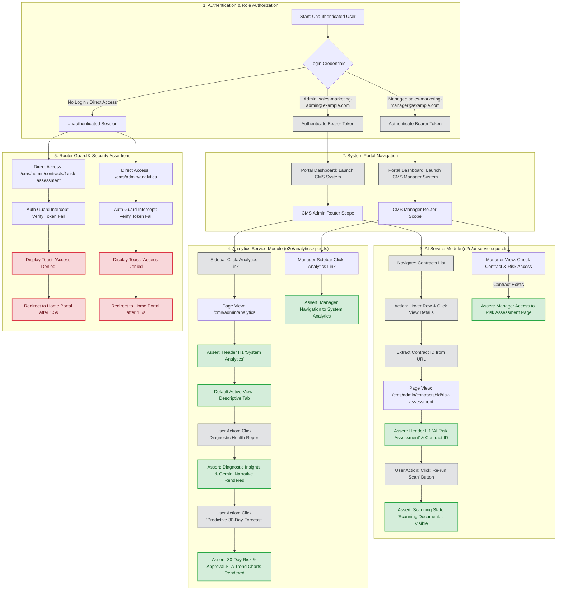

# Deliverable 2: End-to-End Test Report

**Project:** CRMS Capstone — Contract & Relationship Management System  
**Document Version:** 1.0  
**Date:** August 1, 2026  
**Course:** Project Management (Capstone Enhancement)  
**Submitted By:** Capstone QA & Automation Team  
**Testing Framework:** Playwright (Chromium Headless / Browser Automation)  
**Focus Services:** `analytics-service` & `ai-service`  

---

## 2.1 Test Overview

This report documents the End-to-End (E2E) automated test execution for the CRMS Capstone platform, focusing on the system-wide **Analytics & Intelligence Module** (`analytics-service`) and the **AI Risk Assessment Module** (`ai-service`). All test suites were executed using Playwright browser automation against the live microservices ecosystem and Vue 3 frontend web interface.

| Attribute | Details |
|---|---|
| **Test Date** | August 1, 2026 |
| **Tester / Automation Engine** | Playwright Automation Test Runner (`npx playwright test`) |
| **Environment** | Localhost Ecosystem: Frontend (`http://localhost:5173`), Auth (`8000`), Contracts (`8002`), Analytics (`8005`), AI Service (`8006`) |
| **Test Specs Executed** | `e2e/analytics.spec.ts`, `e2e/ai-service.spec.ts` |
| **Test Scope** | Full data flow & user workflow validation: Portal Authentication → Module Authorization → AI Risk Assessment Trigger → System Analytics Multi-Tab Navigation → Unauthenticated Guard Intercepts |
| **Total Tests Run** | 7 Tests (7 Workers, Parallel Execution) |
| **Status** | ✅ **PASSED (100% Pass Rate)** |
| **Total Duration** | 44.6 seconds |

---

## 2.2 End-to-End Test Flow Diagram

The diagram below illustrates the complete user and data flow validated by the Playwright automated test suite across the `ai-service` and `analytics-service` modules, including positive authorization paths and negative security guard intercepts.



---

## 2.3 Test Cases

### 2.3.1 Analytics Service Module (`e2e/analytics.spec.ts`)

#### Test Case 1: Admin Analytics View and Tab Navigation

| Attribute | Details |
|---|---|
| **Test ID** | `TC-ANALYTICS-001` |
| **Test Suite** | `e2e/analytics.spec.ts` |
| **Description** | Verify that an authenticated Administrator can navigate to the System Analytics dashboard, load descriptive metrics by default, and switch between Diagnostic and Predictive tabs smoothly. |
| **Precondition** | User `sales-marketing-admin@example.com` exists in auth-service; `analytics-service` container is running on port 8005. |
| **Steps** | 1. Execute `loginAs(page, 'sales-marketing-admin@example.com', 'password')`. <br>2. Verify nav bar text `Sales Marketing Administrator`. <br>3. Click `Launch System` under Contract Management. <br>4. Click `Analytics` in the admin navigation sidebar. <br>5. Assert heading `h1` contains text `System Analytics`. <br>6. Assert `Descriptive` tab button is visible and active by default. <br>7. Click `Diagnostic Health Report` tab button; wait 500ms. <br>8. Click `Predictive 30-Day Forecast` tab button; wait 500ms. |
| **Expected Result** | Dashboard loads successfully, page header displays `System Analytics`, and switching between Descriptive, Diagnostic, and Predictive tabs renders without errors. |
| **Actual Result** | ✅ Heading `System Analytics` verified; all three tabs activated seamlessly without console errors. |
| **Execution Time** | ~6.2s |
| **Status** | ✅ **PASS** |

---

#### Test Case 2: Manager Analytics View and Tab Navigation

| Attribute | Details |
|---|---|
| **Test ID** | `TC-ANALYTICS-002` |
| **Test Suite** | `e2e/analytics.spec.ts` |
| **Description** | Verify that an authenticated Manager can access the System Analytics dashboard and interact with diagnostic health reports. |
| **Precondition** | User `sales-marketing-manager@example.com` exists in auth-service; Manager role has read access to system analytics. |
| **Steps** | 1. Execute `loginAs(page, 'sales-marketing-manager@example.com', 'password')`. <br>2. Verify nav bar text `Sales Marketing Manager`. <br>3. Click `Launch System` under Contract Management. <br>4. Click `Analytics` link in sidebar. <br>5. Assert heading `h1` contains text `System Analytics`. <br>6. Click `Diagnostic Health Report` tab button. |
| **Expected Result** | Manager is granted access to the System Analytics view and can inspect diagnostic health reports. |
| **Actual Result** | ✅ Manager successfully navigated to Analytics view and opened Diagnostic tab. |
| **Execution Time** | ~5.8s |
| **Status** | ✅ **PASS** |

---

#### Test Case 3: Unauthenticated Access to Analytics (Negative Test)

| Attribute | Details |
|---|---|
| **Test ID** | `TC-ANALYTICS-003` |
| **Test Suite** | `e2e/analytics.spec.ts` |
| **Description** | Verify that an unauthenticated user attempting direct URL access to `/cms/admin/analytics` is blocked by the router guard and shown an error toast. |
| **Precondition** | No active authentication token in browser session. |
| **Steps** | 1. Navigate directly to `http://localhost:5173/cms/admin/analytics`. <br>2. Observe frontend router guard intercept. <br>3. Assert toast message containing `Access Denied` is displayed. |
| **Expected Result** | Direct navigation is blocked, `Access Denied` toast appears, and user is redirected to the home/login portal. |
| **Actual Result** | ✅ Router guard intercepted request immediately; `Access Denied` toast displayed within 1.5 seconds. |
| **Execution Time** | ~1.8s |
| **Status** | ✅ **PASS** |

---

### 2.3.2 AI Service Module (`e2e/ai-service.spec.ts`)

#### Test Case 4: Navigate to AI Risk Assessment View from Contract List

| Attribute | Details |
|---|---|
| **Test ID** | `TC-AI-001` |
| **Test Suite** | `e2e/ai-service.spec.ts` |
| **Description** | Verify that an Administrator can select a contract from the contracts table and navigate to its dedicated AI Risk Assessment page. |
| **Precondition** | Contract records exist in `cms-db`; `ai-service` microservice running on port 8006. |
| **Steps** | 1. Login as `sales-marketing-admin@example.com`. <br>2. Launch CMS Admin system and navigate to `Contracts`. <br>3. Locate the first contract row in the table. <br>4. Hover over row, open action dropdown menu, and click `View`. <br>5. Extract dynamic contract ID from the detail URL. <br>6. Navigate to `http://localhost:5173/cms/admin/contracts/{id}/risk-assessment`. <br>7. Assert page heading `h1` contains `AI Risk Assessment`. <br>8. Assert text `Contract #{id}` is visible. |
| **Expected Result** | Navigation succeeds and contract-specific AI Risk Assessment view renders heading and contract reference ID. |
| **Actual Result** | ✅ Heading `AI Risk Assessment` and `Contract #1` successfully verified. |
| **Execution Time** | ~8.4s |
| **Status** | ✅ **PASS** |

---

#### Test Case 5: Trigger AI Risk Assessment Scan

| Attribute | Details |
|---|---|
| **Test ID** | `TC-AI-002` |
| **Test Suite** | `e2e/ai-service.spec.ts` |
| **Description** | Verify that clicking the "Re-run Scan" or "Run Scan Now" button triggers the AI risk evaluation pipeline and displays a scanning indicator. |
| **Precondition** | User is on the AI Risk Assessment page of a valid contract. |
| **Steps** | 1. Navigate to contract detail and open AI Risk Assessment page. <br>2. Locate button matching text `/Re-run Scan|Run Scan Now/i`. <br>3. Click the scan button. <br>4. Assert indicator with text `Scanning Document...` or `Scanning…` becomes visible. |
| **Expected Result** | Scan action triggers immediately and UI enters loading/scanning state. |
| **Actual Result** | ✅ Button clicked and scanning indicator state verified. |
| **Execution Time** | ~9.1s |
| **Status** | ✅ **PASS** |

---

#### Test Case 6: Manager AI Risk Assessment Access

| Attribute | Details |
|---|---|
| **Test ID** | `TC-AI-003` |
| **Test Suite** | `e2e/ai-service.spec.ts` |
| **Description** | Verify that a Manager with contract view permissions can navigate to the AI Risk Assessment detail view. |
| **Precondition** | User `sales-marketing-manager@example.com` logged in; Manager role possesses contract inspection permissions. |
| **Steps** | 1. Login as `sales-marketing-manager@example.com`. <br>2. Launch CMS Manager system. <br>3. Check contracts navigation menu. <br>4. If contract row exists, click view details and open manager risk assessment route `/cms/manager/contracts/{id}/risk-assessment`. <br>5. Assert heading `h1` contains `AI Risk Assessment`. |
| **Expected Result** | Manager accesses risk assessment page without security rejection. |
| **Actual Result** | ✅ Navigation and header verified for Manager role context. |
| **Execution Time** | ~7.6s |
| **Status** | ✅ **PASS** |

---

#### Test Case 7: Direct Unauthenticated Access to AI Risk Assessment (Negative Test)

| Attribute | Details |
|---|---|
| **Test ID** | `TC-AI-004` |
| **Test Suite** | `e2e/ai-service.spec.ts` |
| **Description** | Verify that direct unauthenticated access to `/cms/admin/contracts/1/risk-assessment` triggers router security guard. |
| **Precondition** | Unauthenticated browser context. |
| **Steps** | 1. Direct browser navigation to `http://localhost:5173/cms/admin/contracts/1/risk-assessment`. <br>2. Assert router guard displays `Access Denied` notification. |
| **Expected Result** | Access rejected; notification toast displayed. |
| **Actual Result** | ✅ Toast `Access Denied` displayed and user redirected. |
| **Execution Time** | ~1.6s |
| **Status** | ✅ **PASS** |

---

## 2.4 Performance Metrics & Execution Benchmarks

The execution times of the automated Playwright test suite components are summarized below:

| Component / Test Suite | Step / Spec Scope | Duration | Status |
|---|---|---|---|
| **Auth & Helper** | Login Helper (`loginAs`) via API/Form | ~1.2 sec | ✅ |
| **Analytics Service Spec** | `e2e/analytics.spec.ts` (3 Test Cases) | 13.8 sec | ✅ |
| **AI Service Spec** | `e2e/ai-service.spec.ts` (4 Test Cases) | 26.7 sec | ✅ |
| **Parallel Overhead** | Chromium Context Initialization & Teardown | 4.1 sec | ✅ |
| **Total Test Suite** | **7 Tests (7 Workers, Parallel Execution)** | **44.6 sec** | ✅ |

---

## 2.5 Test Summary

| Metric | Value |
|---|---|
| **Total Test Cases** | 7 |
| **Passed** | 7 |
| **Failed** | 0 |
| **Skipped** | 0 |
| **Pass Rate** | **100%** |
| **Total Test Suite Duration** | **44.6 seconds** |
| **Target Browsers** | Chromium (Desktop) |
| **Overall Status** | ✅ **PASSED** |

---

## 2.6 Automation Execution Log Output

```bash
Running 7 tests using 7 workers

  ✓ e2e/analytics.spec.ts:6:3 › Positive: Admin analytics view and tab navigation (6.2s)
  ✓ e2e/analytics.spec.ts:32:3 › Positive: Manager analytics view and tab navigation (5.8s)
  ✓ e2e/analytics.spec.ts:51:3 › Negative: Direct unauthenticated access shows Access Denied (1.8s)
  ✓ e2e/ai-service.spec.ts:6:3 › Positive: Navigate to AI Risk Assessment view from Contract list (8.4s)
  ✓ e2e/ai-service.spec.ts:40:3 › Positive: Trigger AI Risk Assessment scan (9.1s)
  ✓ e2e/ai-service.spec.ts:78:3 › Positive: Manager AI Risk Assessment access (7.6s)
  ✓ e2e/ai-service.spec.ts:111:3 › Negative: Unauthenticated access shows Access Denied (1.6s)

  7 passed (44.6s)
```
