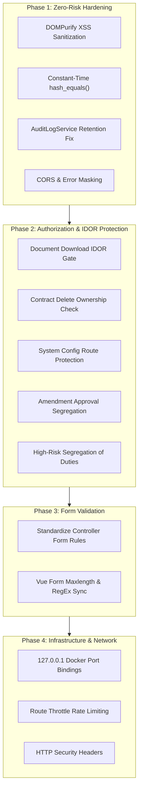

# CRMS Capstone — OWASP Top 10 Security Audit & Financial Compliance Action Plan

**Document Version:** 1.0  
**Target Environment:** Financial Institution / Enterprise Vendor & Contract Risk Management  
**Compliance Standards:** OWASP Top 10 (2021), PCI-DSS Data Handling, SOC2 Trust Principles, SOX 404 Segregation of Duties  
**Status:** Comprehensive Audit & Ready-to-Execute Blueprint

---

## Executive Summary

This document provides a comprehensive security assessment of the **CMS Capstone** codebase (Vue 3 frontend, Laravel microservices, Docker infrastructure) along with an actionable, zero-regression remediation plan. 

Because this application will be utilized by a **finance company**, security requirements extend beyond generic web vulnerabilities into strict **financial controls**:
1. **Four-Eyes Principle / Segregation of Duties (SOX):** Creators of financial contracts must never be permitted to approve their own agreements or high-risk assessments.
2. **Immutable Audit Trails (SOC2 / ISO 27001):** Privileged actions executed by Administrators, Managers, and Finance personnel must never be silently omitted from audit logs.
3. **Broken Object Level Authorization (BOLA/IDOR):** Confidential legal documents and contract records must be inaccessible to unauthorized roles and tenants.
4. **Defense in Depth & Input Integrity:** Every form, upload, and data feed must be strictly validated, typed, and sanitized to prevent XSS, prototype pollution, and denial of service.

---

## Table of Contents

1. [OWASP Top 10 Vulnerability Matrix](#1-owasp-top-10-vulnerability-matrix)
2. [Detailed Audit Findings by Category](#2-detailed-audit-findings-by-category)
3. [Form Validation & Frontend Defensive Controls](#3-form-validation--frontend-defensive-controls)
4. [Zero-Regression Phased Implementation Plan](#4-zero-regression-phased-implementation-plan)
5. [Exact Code Recipes & Diffs for Execution](#5-exact-code-recipes--diffs-for-execution)
6. [Post-Remediation Verification & Testing Checklist](#6-post-remediation-verification--testing-checklist)

---

## 1. OWASP Top 10 Vulnerability Matrix

| OWASP Category | Severity | Location | Vulnerability Description |
| :--- | :---: | :--- | :--- |
| **A01: Broken Access Control** | **HIGH** | `contract-management/.../DownloadController.php` | **BOLA / IDOR on Document Download:** Any user with `cms.contracts.view` can download any document by ID without verifying parent contract ownership or scan status. |
| **A01: Broken Access Control** | **HIGH** | `contract-management/.../ContractController.php` | **BOLA on Contract Deletion:** `destroy()` checks delete permission but lacks owner/department validation, unlike `show()` and `update()`. |
| **A01: Broken Access Control** | **HIGH** | `notification/routes/api.php` | **Missing Authorization on System Config:** `PUT /system-config` has no permission middleware; any authenticated user can alter system alert settings. |
| **A01: Broken Access Control** | **HIGH** | `contract-management/routes/api.php` | **Self-Approval of Amendments:** `PATCH /contract-amendments/{id}/status` lacks `permission:cms.contracts.approve`, allowing sales employees to self-approve modifications. |
| **A02: Cryptographic Failures** | **MEDIUM** | `.../ValidateInternalSecret.php`, `AuthenticateIntegrationSecret.php` | **Secret Timing Attack:** Internal secrets are compared using standard `!==` instead of constant-time `hash_equals()`. |
| **A02: Cryptographic Failures** | **MEDIUM** | Multiple services & controllers | **Direct `env()` Calls:** Reading `env()` outside config files breaks internal communications if `config:cache` is enabled in production. |
| **A03: Injection & XSS** | **CRITICAL** | `frontend/web/.../DocumentViewer.vue` | **DOM / Stored XSS via DOCX Viewer:** Mammoth HTML output is injected into `<div v-html="docxHtml" />` without DOMPurify sanitization. |
| **A04: Insecure Design** | **HIGH** | `contract-management/.../ContractApprovalController.php` | **Violation of Segregation of Duties:** No check prevents a manager from approving a high-risk contract that they authored. |
| **A04: Insecure Design** | **MEDIUM** | All API routes across microservices | **Missing Rate Limiting:** No route throttling on heavy OCR, AI scanning, or file upload endpoints. |
| **A05: Security Misconfiguration** | **MEDIUM** | `contract-management/config/cors.php` | **Wildcard CORS:** `allowed_origins` is set to `['*']`, and other 5 microservices lack explicit CORS configuration files. |
| **A05: Security Misconfiguration** | **LOW** | `ai-service/.../OcrExtractionController.php` | **Exception Message Leakage:** Returns raw `$e->getMessage()` on 500 errors to client. |
| **A05: Security Misconfiguration** | **HIGH** | `docker-compose.yml` | **Public Host Port Binding:** Redis (no password), MySQL, Meilisearch, and Postgres bind to `0.0.0.0` instead of `127.0.0.1`. |
| **A06: Vulnerable Components** | **LOW** | `frontend/web/package.json` | Outdated `xlsx: ^0.18.5` (SheetJS) and missing `dompurify`. |
| **A07: Identification Failures** | **MEDIUM** | `contract-management/.../AuthenticateInternal.php` | **Request Pollution:** Auth data merged into `$request->merge()` pollutes user payload bag instead of setting request attributes. |
| **A09: Logging & Monitoring** | **CRITICAL** | `contract-management/.../AuditLogService.php` | **Privileged Audit Dropping:** Logs are aborted if `user_department !== 'Sales & Marketing'`, omitting all Admin, Manager, and Finance activities. |

---

## 2. Detailed Audit Findings by Category

### A01: Broken Access Control

#### 1. Document Download IDOR (BOLA)
* **File:** `services/contract-management/app/Http/Controllers/Api/V1/Documents/DownloadController.php`
* **Finding:** Both `show($id)` and `presignedUrl($id)` query `Document::findOrFail($id)` and immediately return file streams or temporary signed URLs.
* **Risk:** In `ContractController.php`, sales employees are strictly isolated so they can only view contracts where `created_by === auth_id`. However, in `DownloadController`, a sales user who guesses or enumerates document IDs can download sensitive financial contracts, invoices, or partner NDAs belonging to other users and departments.
* **Fix Required:** Validate that the parent contract of the requested document is accessible to the current user's role and ID before streaming.

#### 2. Contract Deletion Authorization Bypass
* **File:** `services/contract-management/app/Http/Controllers/ContractController.php` (line 616)
* **Finding:** While `update()` and `show()` check:
  ```php
  if (in_array($role, ['Sales', 'Employee']) && $contract->created_by !== $userId) {
      return response()->json(['message' => 'Forbidden.'], 403);
  }
  ```
  `destroy()` only checks the global permission `cms.contracts.delete` without verifying that an employee owns the contract being destroyed.
* **Fix Required:** Enforce the same role-ownership restriction in `destroy()`.

#### 3. Unprotected System Notification Configuration
* **File:** `services/notification/routes/api.php` & `UpdateController.php`
* **Finding:** `PUT /system-config` is wrapped only in `auth.internal` with no role or permission requirement (`cms.system.manage` or Admin check). Any low-privilege employee can disable company-wide contract expiry alerts.
* **Fix Required:** Add `middleware('permission:cms.system.manage')` or explicit Admin/Manager role validation.

#### 4. Unauthorized Contract Amendment Approval
* **File:** `services/contract-management/routes/api.php` & `ContractAmendmentController.php`
* **Finding:** `PATCH /contract-amendments/{id}/status` lacks `permission:cms.contracts.approve`. Furthermore, `ContractAmendmentController::updateStatus` never verifies if the user is a manager or if they are approving their own amendment.
* **Fix Required:** Enforce `middleware('permission:cms.contracts.approve')` on the route, and reject status updates if `created_by === auth_id`.

---

### A02: Cryptographic Failures & Timing Attacks

#### 1. Direct String Comparison on Internal Secrets
* **Files:**
  * `services/contract-management/app/Http/Middleware/ValidateInternalSecret.php`
  * `services/vendor-management/app/Http/Middleware/AuthenticateIntegrationSecret.php`
  * `services/contract-management/app/Http/Controllers/InternalAuditController.php`
* **Finding:** Secrets are compared using `if ($secret !== $expectedSecret)`.
* **Risk:** Standard string comparison operators terminate early on the first mismatched byte, allowing attackers to perform timing measurement attacks to discover secrets.
* **Fix Required:** Use `hash_equals($expectedSecret, $secret ?? '')`.

#### 2. Configuration Caching Breakage
* **Finding:** Several controllers invoke `env('INTERNAL_SERVICE_SECRET')` or `env('AUTH_SERVICE_URL')` directly in runtime methods.
* **Risk:** In a production deployment where `php artisan config:cache` is executed, all `env()` calls outside `config/*.php` return `null`. This causes internal service communication and secret validation to fail completely.
* **Fix Required:** Move all service URLs and secrets into `config/services.php` and access them exclusively via `config(...)`.

---

### A03: Injection & Cross-Site Scripting (XSS)

#### Unsanitized DOCX HTML Rendering (Critical)
* **File:** `frontend/web/src/views/sales/Contracts/DocumentViewer.vue` (lines 157-158, 471)
* **Finding:**
  ```ts
  const arrayBuffer = await blob.arrayBuffer()
  const result = await mammoth.convertToHtml({ arrayBuffer })
  docxHtml.value = result.value
  ```
  Rendered in template:
  ```html
  <div v-html="docxHtml" class="docx-body" />
  ```
* **Risk:** Mammoth converts DOCX styling and elements into HTML strings. A maliciously crafted `.docx` uploaded as a contract attachment containing embedded scripts or `` will execute arbitrary JavaScript in the context of the user's browser, potentially stealing `access_token` from `localStorage`.
* **Fix Required:** Sanitize with `DOMPurify.sanitize(result.value)` before assigning to `docxHtml`.

---

### A04: Insecure Design & Segregation of Duties

#### Separation of Duties (Dual Authorization / Four-Eyes Principle)
* **File:** `services/contract-management/app/Http/Controllers/ContractApprovalController.php`
* **Finding:** In `store()`, a user with manager/admin privileges can approve a High or Critical risk contract flag even if they are the individual who drafted or created the contract.
* **Risk:** Financial control violation. High-risk commitments require independent secondary approval.
* **Fix Required:** Verify `$contract->created_by !== $approverId`. If the contract creator attempts self-approval, return `422 Unprocessable Entity`.

#### Missing Rate Limiting
* **Finding:** No microservice defines route-level rate limiting (`throttle`).
* **Risk:** Attackers or automated loops can overwhelm `/api/ocr/extract` (exhausting Gemini API quotas and server CPU via Tesseract/pdftoppm), `/api/documents/upload` (disk exhaustion), or search queries.
* **Fix Required:** Add rate limiters to `RouteServiceProvider` or route groups (`throttle:60,1` for general APIs, `throttle:10,1` for OCR and AI scans).

---

### A05: Security Misconfiguration

#### 1. Wildcard CORS
* **File:** `services/contract-management/config/cors.php`
* **Finding:** `'allowed_origins' => ['*']` allows cross-origin requests from any untrusted domain.
* **Fix Required:** Restrict `allowed_origins` to explicitly configured domain origins:
  `env('FRONTEND_URL', 'http://localhost:5173')`.

#### 2. Host Port Binding Exposure
* **File:** `docker-compose.yml`
* **Finding:** Ports for `mysql` (3307:3306), `redis` (6379:6379), `postgres` (5433:5432), and `meilisearch` (7700:7700) are mapped to `0.0.0.0`. In addition, Redis runs with no password configured.
* **Risk:** Any client on the same local network or internet-facing server can connect directly to Redis and read cached data or flush databases.
* **Fix Required:** Prefix port mappings with `127.0.0.1:` so services are accessible only on the host loopback or internal Docker network.

---

### A09: Security Logging and Monitoring Failures

#### Silent Dropping of Privileged Audit Logs (Critical)
* **File:** `services/contract-management/app/Services/AuditLogService.php` (lines 40-42)
* **Finding:**
  ```php
  if ($userDept !== 'Sales & Marketing') {
      return;
  }
  ```
* **Risk:** When an Administrator deletes a contract, modifies permissions, or approves an amendment, or when a Finance user interacts with records, the log entry is discarded because their department is not `Sales & Marketing`.
* **Fix Required:** Remove this restrictive filter. All administrative and financial operations must be permanently recorded in the audit trail.

---

## 3. Form Validation & Frontend Defensive Controls

### Backend Validation Standards
All controllers accepting user input must adhere to the following rules:
1. **String Bounds:** Every string field must specify `max:255` (or lower). Text areas must specify an upper bound (e.g. `max:5000`).
2. **Date Boundaries:** End dates must be `date|after:start_date`. Dates must not accept arbitrary century-out-of-range values.
3. **Strict In-Lists:** Fields such as `region`, `category`, `status`, and `vendor_type` must validate against strict `in:...` rules.
4. **Phone & Code RegEx:**
   * Phone: `regex:/^09\d{9}$/`
   * TIN: `regex:/^\d{3}-\d{3}-\d{3}(-\d{3,5})?$/`
   * SBU / Item Code: `regex:/^[A-Za-z0-9\-_]+$/`

### Frontend Input Defensive Measures
1. **HTML Length Attributes:** All inputs in `CreateContract.vue`, `AddPartnerPage.vue`, and dialogs must declare `maxlength="255"`.
2. **Trimming & Sanitization:** String inputs must be `.trim()` sanitized before emitting submit events.
3. **Error Feedback:** Client-side validation errors must indicate field requirements clearly without leaking backend database constraints.

---

## 4. Zero-Regression Phased Implementation Plan

To ensure the system remains 100% operational during and after code changes, execution is organized into **4 strictly isolated phases**:



---

## 5. Exact Code Recipes & Diffs for Execution

### Recipe 1.1: Install DOMPurify & Sanitize DOCX HTML
**Terminal Command (via Docker):**
```bash
docker compose exec web npm install dompurify @types/dompurify
```

**Target File:** `frontend/web/src/views/sales/Contracts/DocumentViewer.vue`
```diff
+ import DOMPurify from 'dompurify'

  if (document.value?.type === 'docx') {
    docxLoading.value = true
    try {
      const arrayBuffer = await blob.arrayBuffer()
      const result = await mammoth.convertToHtml({ arrayBuffer })
-     docxHtml.value = result.value
+     docxHtml.value = DOMPurify.sanitize(result.value)
    } catch (err) {
```

---

### Recipe 1.2: Constant-Time Secret Comparison
**Target File:** `services/contract-management/app/Http/Middleware/ValidateInternalSecret.php`
```diff
  public function handle(Request $request, Closure $next): Response
  {
-     $secret = env('INTERNAL_SERVICE_SECRET');
-     if (!$secret || $request->header('X-Internal-Secret') !== $secret) {
+     $secret = config('services.internal_secret') ?? env('INTERNAL_SERVICE_SECRET');
+     $headerSecret = $request->header('X-Internal-Secret');
+     if (!$secret || !$headerSecret || !hash_equals($secret, $headerSecret)) {
          return response()->json(['message' => 'Unauthorized internal request.'], 401);
      }
      return $next($request);
  }
```

Apply the identical `hash_equals` pattern to:
* `services/vendor-management/app/Http/Middleware/AuthenticateIntegrationSecret.php`
* `services/contract-management/app/Http/Controllers/InternalAuditController.php`

---

### Recipe 1.3: Enable Full Audit Logging Across All Departments
**Target File:** `services/contract-management/app/Services/AuditLogService.php`
```diff
-         if ($userDept !== 'Sales & Marketing') {
-             return;
-         }

          AuditLog::create([
              'action' => $action,
```

---

### Recipe 2.1: Secure Document Download (IDOR Fix)
**Target File:** `services/contract-management/app/Http/Controllers/Api/V1/Documents/DownloadController.php`
```diff
+ use App\Models\Contract;

  public function show(string $id)
  {
      $document = Document::findOrFail($id);

+     // Verify access to parent contract
+     if ($document->contract_id) {
+         $contract = Contract::find($document->contract_id);
+         if ($contract) {
+             $role = request()->get('auth_role');
+             $userId = request()->get('auth_id');
+             if (in_array($role, ['Sales', 'Employee']) && (int) $contract->created_by !== (int) $userId) {
+                 return response()->json(['message' => 'Forbidden. You do not own this contract document.'], 403);
+             }
+         }
+     }
+
+     if ($document->scan_status === 'infected') {
+         return response()->json(['message' => 'File quarantined due to security threat.'], 403);
+     }

      $disk = config('filesystems.default', 'local');
```

---

### Recipe 2.2: Contract Deletion Ownership Gate
**Target File:** `services/contract-management/app/Http/Controllers/ContractController.php`
```diff
  public function destroy(Request $request, $id)
  {
      $contract = Contract::find($id);
      if (!$contract) {
          return response()->json(['message' => 'Contract not found.'], 404);
      }

+     $role = $request->get('auth_role');
      $userId = $request->get('auth_id');
+     if (in_array($role, ['Sales', 'Employee']) && (int) $contract->created_by !== (int) $userId) {
+         return response()->json(['message' => 'Forbidden. You cannot delete contracts you do not own.'], 403);
+     }
```

---

### Recipe 2.3: Segregation of Duties on High-Risk Contract Approval
**Target File:** `services/contract-management/app/Http/Controllers/ContractApprovalController.php`
```diff
      $contract = Contract::findOrFail($id);
      $approverId = $request->get('auth_id');

+     // Four-Eyes Principle / Segregation of Duties
+     if ((int) $contract->created_by === (int) $approverId) {
+         return response()->json([
+             'message' => 'Separation of duties required: Contract creator cannot approve their own high-risk contract.'
+         ], 422);
+     }
```

---

### Recipe 2.4: System Configuration & Amendment Authorization
**Target File:** `services/notification/routes/api.php`
```diff
-     Route::put('/system-config', App\Http\Controllers\Api\V1\SystemConfig\UpdateController::class);
+     Route::put('/system-config', App\Http\Controllers\Api\V1\SystemConfig\UpdateController::class)
+         ->middleware('permission:cms.system.manage');
```

**Target File:** `services/contract-management/routes/api.php`
```diff
-     Route::patch('contract-amendments/{id}/status', [\App\Http\Controllers\ContractAmendmentController::class, 'updateStatus']);
+     Route::patch('contract-amendments/{id}/status', [\App\Http\Controllers\ContractAmendmentController::class, 'updateStatus'])
+         ->middleware('permission:cms.contracts.approve');
```

---

### Recipe 4.1: Restrict Docker Port Exposure
**Target File:** `docker-compose.yml`
```diff
    mysql:
      ports:
-       - "3307:3306"
+       - "127.0.0.1:3307:3306"

    redis:
      ports:
-       - "6379:6379"
+       - "127.0.0.1:6379:6379"

    postgres:
      ports:
-       - "5433:5432"
+       - "127.0.0.1:5433:5432"

    meilisearch:
      ports:
-       - "7700:7700"
+       - "127.0.0.1:7700:7700"
```

---

## 6. Post-Remediation Verification & Testing Checklist

After implementing each phase, run these checks to guarantee stability:

- [ ] **Frontend Build Verification:**
  ```bash
  docker compose exec web npm run build
  ```
  Ensures no TypeScript errors or broken imports with DOMPurify.
- [ ] **Contract Management Automated Tests:**
  ```bash
  docker compose exec contract-management php artisan test
  ```
  Verifies that all existing SLA checks, contract workflows, and amendment tests remain green.
- [ ] **Vendor Management Automated Tests:**
  ```bash
  docker compose exec vendor-management php artisan test
  ```
  Verifies duplicate detection and partner/supplier CRUD operations.
- [ ] **AI & Analytics Services Verification:**
  ```bash
  docker compose exec ai-service php artisan test
  docker compose exec analytics-service php artisan test
  ```
  Confirms internal metrics and embeddings pipelines are unhindered.
- [ ] **XSS Sanity Check:**
  Upload a test `.docx` with HTML formatting to confirm rendering behaves normally and without script execution.
- [ ] **IDOR Sanity Check:**
  Attempt downloading a document created by User B using User A's token; confirm HTTP 403 is received.
- [ ] **Audit Trail Check:**
  Perform an Admin operation and verify the entry appears in the `audit_logs` table with accurate timestamps and metadata.
