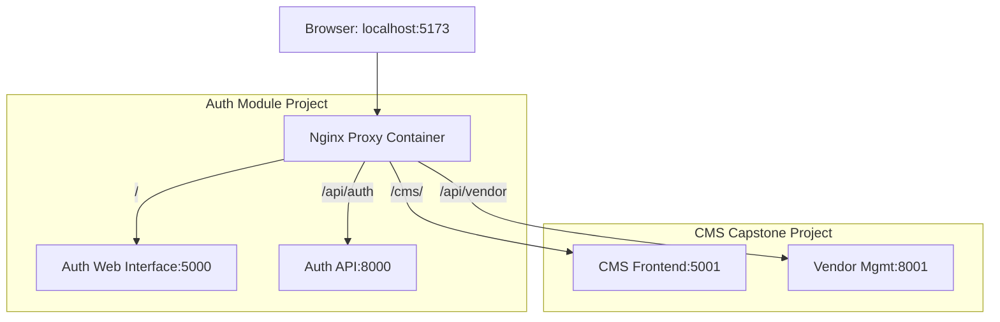

# Nginx Reverse Proxy (Shared Gateway) Architecture

This document explains how the **Nginx Reverse Proxy** (Shared Gateway) is configured to manage traffic across multiple microservices in the CMS and Auth modules.

## 1. How it Works

The gateway acts as an **Nginx Reverse Proxy**—a single entry point for the entire ecosystem. Instead of accessing each service via its own port (e.g., 5000, 5001, 8001), you access everything through a single port (**5173**) on `localhost`.

### The Mechanism
1.  **Shared Docker Network:** All services (Auth, CMS, Databases) are connected to an external Docker network called `shared-capstone-network`.
2.  **Service Discovery:** Because they are on the same network, Nginx can reach other containers using their `container_name` or `service_name` (e.g., `http://cms-web:5001`) instead of an IP address.
3.  **Path-Based Routing:** Nginx looks at the URL path and "proxies" the request to the correct internal service.



---

## 2. Benefits

*   **Unified URL:** No need to remember different ports for different services.
*   **CORS Simplification:** Since everything is on the same domain/port (`localhost:5173`), you avoid many Cross-Origin Resource Sharing (CORS) issues.
*   **SSL Termination:** In production, you only need to install an SSL certificate on the Nginx gateway, not on every individual microservice.
*   **Seamless Integration:** You can host the Auth module and CMS module as if they were a single website.

---

## 3. How to Setup for New Services

If you create a new service (e.g., `inventory-management`), follow these steps to integrate it into the gateway:

### Step 1: Update the Service's `docker-compose.yml`
Ensure the new service joins the shared network.

```yaml
services:
  inventory-service:
    container_name: inventory-service
    # ... other config ...
    networks:
      - shared-capstone-network

networks:
  shared-capstone-network:
    external: true
```

### Step 2: Update `nginx.conf` (in auth-module)
Add a new `location` block to the `server` section in `nginx/nginx.conf`:

```nginx
# New Inventory Service
location /inventory/ {
    proxy_pass http://inventory-service:8000; # Use the internal service name and port
    proxy_http_version 1.1;
    proxy_set_header Upgrade $http_upgrade;
    proxy_set_header Connection "upgrade";
    proxy_set_header Host $host;
}
```

### Step 3: Restart the Proxy
After changing the config, you must restart the Nginx container:
```bash
docker compose up -d nginx-proxy --force-recreate
```

---

## 4. Current Configuration Summary

| Path | Internal Destination | Project |
| :--- | :--- | :--- |
| `/` | `http://web-interface:5000` | Auth Module |
| `/cms/` | `http://cms-web:5001` | CMS Capstone |
| `localhost:8000` | `auth-service` (Direct) | Auth API |
| `localhost:8001` | `vendor-management` (Direct) | CMS API |

> [!TIP]
> Even with the proxy running, you can still access services directly via their mapped ports (8001, 5001, etc.) for debugging, but using the proxy (5173) is recommended for the "real" user experience.
